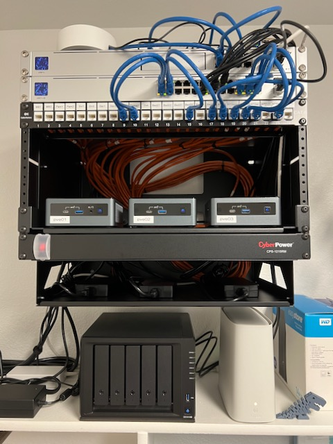

# Homelab

## Hardware
The initial idea was to build compact, energy efficient, low noise system, but capable to run enterprise level software at home. 

### Network
* UniFi UDM-Pro router
* UniFi USW-Pro-24-POE network switch

### Compute
* Intel NUC10i7FNH x3
    * 6-Core Intel i7-10710U
    * 32 GB (16 GB DDR4-2666 MHz x2) 
    * 1 TB NVMe SSD

### Storage
* Synology DS1019+
    * 4-Core Celeron J3455
    * 8 GB (4 GB DDR3L Non-ECC SO-DIMM x2)
    * 10 TB x2 HDD
    * 1 TB x2 SSD

## Software
* [Proxmox cluster](proxmox)
* [Ansible](ansible)
* Kubernetes
* Grafana
* Prometheus